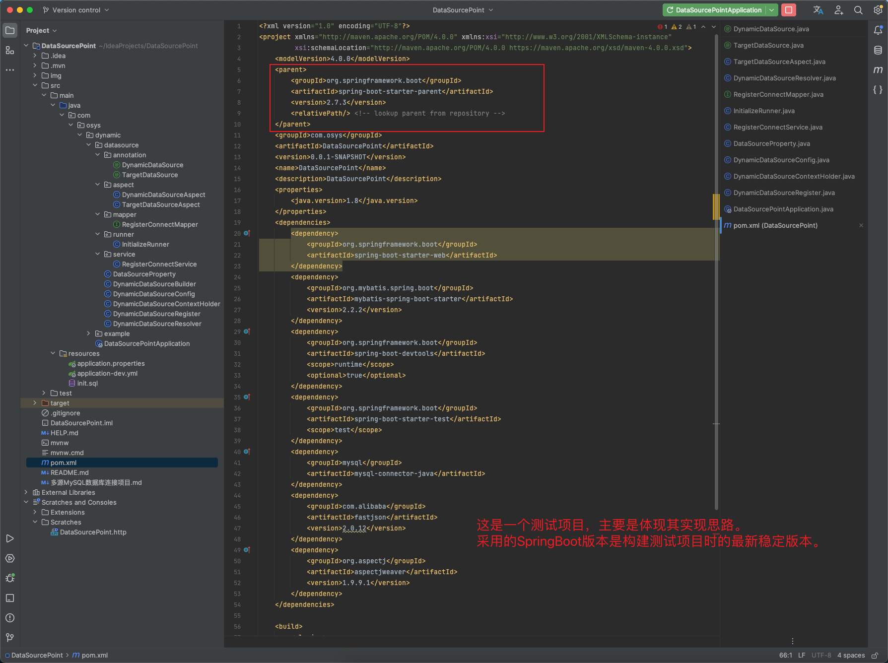
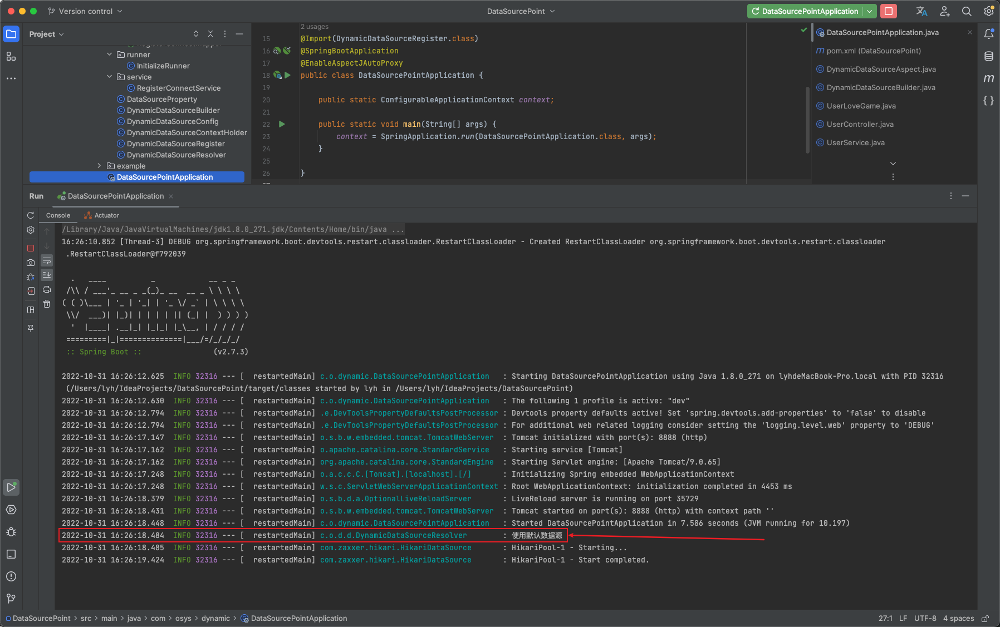
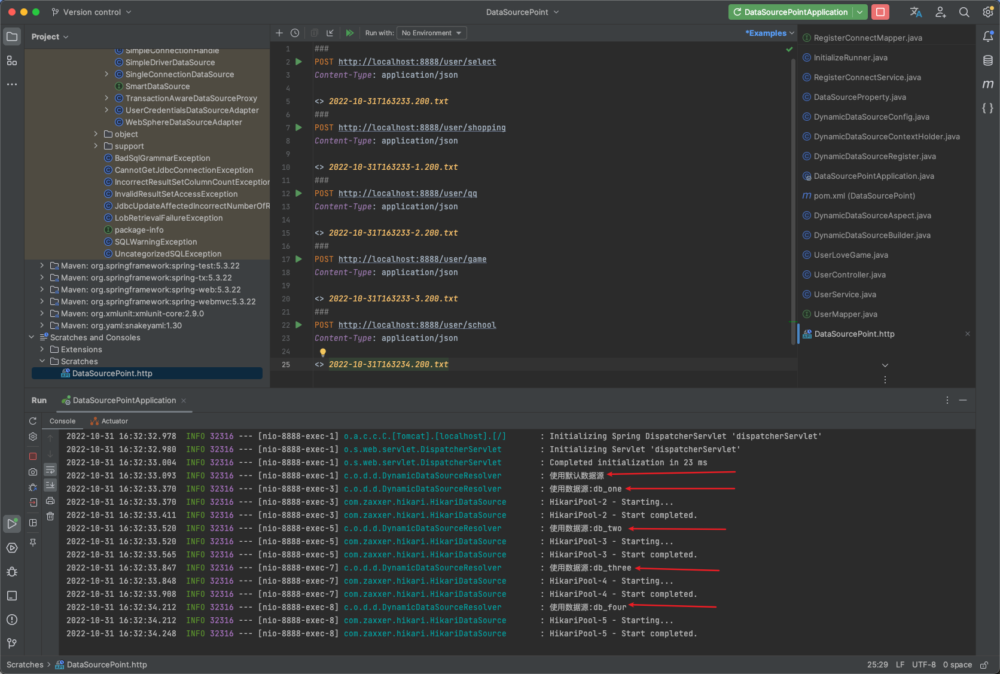

> 说明(主要是实现的思路)

对于使用 SpringBoot 中使用 MySQL 的项目来说，可能会面临一个 SpringBoot 项目连接多个不同的 MySQL 数据库。这里针对普通的 SpringBoot 项目进行实现。关注点在查询前，数据库选择上进行定义。Demo 项目代码已经放到了我的 [GitHub](https://)，是 SpringBoot + MyBatis 的测试项目。通过注解，选择不同的数据库。可能大家在参考的时候会出现各种奇奇怪怪的问题（细心能解决大部分问题哈）


## 1. 普通的 SpringBoot 项目



datasource 目录中的代码为主要实现代码。example 目录下的代码只是用作测试不同MySQL数据源的连接。


## 2. 实现思路

> 数据源连接信息实体类(**getter、setter、constructer省略**)

该实体类的字段信息，根据自己项目特定情况而定。不一定按照如此定义。

```java
package com.osys.dynamic.datasource;

import javax.sql.DataSource;
import java.util.StringJoiner;

public class DataSourceProperty {

    /** 数据库连接类型，后边使用 com.zaxxer.hikari.HikariDataSource 数据库连接池。使用别的数据库连接池思想也一样 */
    private Class<? extends DataSource> clazzType;

    /** 数据库连接驱动：com.mysql.cj.jdbc.Driver、com.mysql.jdbc.Driver。不同的版本用的驱动可能是不一样的 */
    private String driverClassName;

    /** 数据库连接用户名 */
    private String userName;

    /** 数据库连接密码 */
    private String password;

    /** 数据库ip */
    private String host;

    /** 数据库端口 */
    private String port;

    /** 数据库名 */
    private String dataSourceName;

    /** 后边获取该连接信息对应的 key */
    private String key;
}
```


> 数据库连接构建类

对于上面的 DataSourceProperty 保存的是数据库连接信息，这里创建一个构建工具类，用于构建数据库连接。

```java
package com.osys.dynamic.datasource;

import org.springframework.beans.MutablePropertyValues;
import org.springframework.boot.jdbc.DataSourceBuilder;
import org.springframework.core.convert.ConversionService;
import org.springframework.core.convert.support.DefaultConversionService;
import org.springframework.validation.DataBinder;

import javax.sql.DataSource;
import java.util.HashMap;
import java.util.Map;

public class DynamicDataSourceBuilder {

    private DataSourceProperty property;

    private final ConversionService conversionService = new DefaultConversionService();

    /** 默认 DataSource 类型 */
    private static final Class<? extends DataSource> DEFAULT_DATASOURCE_TYPE = com.zaxxer.hikari.HikariDataSource.class;

    public static DynamicDataSourceBuilder create() {
        return new DynamicDataSourceBuilder();
    }

    /** 添加数据库连接信息 */
    public DynamicDataSourceBuilder setPropertyValues(DataSourceProperty dataSourceProperty) {
        this.property = dataSourceProperty;
        return this;
    }

    /** 构建数据库连接 */
    public DataSource build() {
        DataSource dataSource = buildDataSource(this.property);
        return propertySet(dataSource, this.property);
    }

    /** 数据库连接 */
    public DataSource buildDataSource(DataSourceProperty dataSourceProperty) {
        String driverClassName = dataSourceProperty.getDriverClassName();
        Class<? extends DataSource> dataSourceType = dataSourceProperty.getClazzType();
        if (dataSourceType == null) {
            dataSourceType = DEFAULT_DATASOURCE_TYPE;
        }
        String dataSourceName = dataSourceProperty.getDataSourceName();
        String host = dataSourceProperty.getHost();
        String port = dataSourceProperty.getPort();
        String userName = dataSourceProperty.getUserName();
        String password = dataSourceProperty.getPassword();
        String url = "jdbc:mysql://" +
                host + ":" + port +
                "/" + dataSourceName +
                "?" + "useUnicode=true" +
                "&characterEncoding=utf-8" +
                "&serverTimezone=Asia/Shanghai";
        DataSourceBuilder<? extends DataSource> dataSourceBuilder = DataSourceBuilder.create()
                .driverClassName(driverClassName)
                .url(url)
                .username(userName)
                .password(password)
                .type(dataSourceType);
        return dataSourceBuilder.build();
    }

    /** 数据库连接池的一些配置，也可以不用，正常没什么影响。连接池都有默认配置的。 */
    public DataSource propertySet(DataSource dataSource, DataSourceProperty dataSourceProperty) {
        DataBinder dataBinder = new DataBinder(dataSource);
        dataBinder.setConversionService(conversionService);
        dataBinder.setIgnoreInvalidFields(true);
        dataBinder.setIgnoreUnknownFields(true);
        // 新加连接池配置
        Map<String, Object> values = new HashMap<>();
        values.put("max-pool-size", 10);
        values.put("connection-timeout", 50000);
        values.put("min-idle", 5);
        values.put("idle-timeout", 500000);
        values.put("max-lifetime", 540000);
        dataBinder.bind(new MutablePropertyValues(values));
        return dataSource;
    }
}
```


> 多数据源连接信息实体类

上面的 `DataSourceProperty` 保存的时某个数据源的连接信息，由于是多数据源的，会存在多个 `DataSourceProperty` 对象，这里通过数据源 key 来获取对应的数据源连接信息，编写一个保存数据源信息的配置类：

```java
package com.osys.dynamic.datasource;

import org.springframework.context.annotation.Configuration;

import java.util.concurrent.ConcurrentHashMap;
import java.util.concurrent.ConcurrentMap;

@Configuration(value = "dynamicDataSourceConfig")
public class DynamicDataSourceConfig {

    /** 数据源 key 和配置属性实体类的键值对 */
    private final ConcurrentMap<String, DataSourceProperty> dataSourceProps = new ConcurrentHashMap<>();

    /** 保存一个数据源连接信息 */
    public void registerDataSource(DataSourceProperty dataSourceProperty) {
        dataSourceProps.put(dataSourceProperty.getKey(), dataSourceProperty);
    }

    /** 移除一个数据源连接信息 */
    public void removeDataSource(String dataSourceKey) {
        dataSourceProps.remove(dataSourceKey);
    }

    /** 获取一个数据源连接信息 */
    public DataSourceProperty getDataSourceProperty(String dataSourceKey) {
        return dataSourceProps.get(dataSourceKey);
    }
}
```


> **多数据源的选择**

`AbstractRoutingDataSource` 是 SpringBoot 基于查找 key 将 getConnection() 调用路由到各种目标 DataSource 之一的抽象 DataSource 实现。

选择数据源解决方案：编写一个类，继承 `AbstractRoutingDataSource`，实现它的 `determineCurrentLookupKey()` 方法和 `determineTargetDataSource()` 方法，来选择使用哪一个数据源。`DynamicDataSourceConfig` 中 Map 保存到创建的数据连接。

```java
package com.osys.dynamic.datasource;

import org.springframework.beans.factory.annotation.Autowired;
import org.springframework.beans.factory.annotation.Qualifier;
import org.springframework.jdbc.datasource.lookup.AbstractRoutingDataSource;

import javax.sql.DataSource;
import java.util.concurrent.ConcurrentHashMap;
import java.util.concurrent.ConcurrentMap;

/**
 * <p><b>{@link DynamicDataSourceResolver} Description</b>: 在进行查询时，选择需要的 DataSource。
 * 默认为主数据源。key = null 时，为主数据源。
 * key != null 时，如果 dynamicDataSources 中存在对应的数据源，直接取出使用。
 * 如果 dynamicDataSources 中不存在 key 对应的数据源，那么从 dynamicDataSourceConfig 中获取 key 对应的数据源配置(如果存在)，
 * 创建新的数据源，保存在 dynamicDataSources 中，并在查询中使用，否则使用默认数据源(主数据源)。
 * </p>
 * @author Created by osys on 2022/08/30 11:09.
 */
public class DynamicDataSourceResolver extends AbstractRoutingDataSource {

    /** 保存动态数据库连接的 Map， dataSourceKey -> DataSource */
    private static final ConcurrentMap<String, DataSource> dynamicDataSources = new ConcurrentHashMap<>();

    private DynamicDataSourceConfig dynamicDataSourceConfig;

    @Autowired
    @Qualifier(value = "dynamicDataSourceConfig")
    public void setDynamicDataSourceConfig(DynamicDataSourceConfig dynamicDataSourceConfig) {
        this.dynamicDataSourceConfig = dynamicDataSourceConfig;
    }

    /**
     * 确定当前查找 key。这通常会被实现来检查线程绑定的事务上下文。
     * 允许任意键。
     * @return target dataSource key
     */
    @Override
    protected Object determineCurrentLookupKey() {
        // 往下看【线程隔离的 key】处说明
        return DynamicDataSourceContextHolder.getDataSourceKey();
    }

    /**
     * 检索当前目标数据源。
     * 确定 current lookup key，在 targetDataSources 映射中执行查找，必要时回退到指定的default target DataSource。
     */
    @Override
    protected DataSource determineTargetDataSource() {
        Object lookupKey = determineCurrentLookupKey();
        if (lookupKey == null) {
            super.logger.info("使用默认数据源");
            return super.determineTargetDataSource();
        }

        DataSource dataSource = dynamicDataSources.get(String.valueOf(lookupKey));
        if (dataSource != null) {
            super.logger.info("使用数据源:" + lookupKey);
            return dataSource;
        }

        DataSourceProperty dataSourceProperty = dynamicDataSourceConfig.getDataSourceProperty(String.valueOf(lookupKey));
        if (dataSourceProperty == null) {
            super.logger.info("使用默认数据源");
            return super.determineTargetDataSource();
        }
        DataSource createDataSource = DynamicDataSourceBuilder
                .create()
                .setPropertyValues(dataSourceProperty)
                .build();
        dynamicDataSources.put(String.valueOf(lookupKey), createDataSource);
        super.logger.info("使用数据源:" + lookupKey);
        return createDataSource;
    }

    public static void removeDataSource(String key) {
        dynamicDataSources.remove(key);
    }

    public static void addDataSource(String key, DataSource dataSource) {
        dynamicDataSources.put(key, dataSource);
    }
}
```


> 线程隔离的 key

上面的 `DynamicDataSourceResolver#determineTargetDataSource()` 方法中，确定的是 dataSource 的 key。SpringBoot 项目中，CRUD 操作是在不同线程中进行的，不同的需求，连接的MySQL数据库可能是不一样的，因此不同线程之间的 Key 是不能够被其它线程影响到的。使用 `ThreadLocal` 防止任务在共享资源上产生冲突

```java
package com.osys.dynamic.datasource;

/**
 * 使用 ThreadLocal 来指定 DataSource 的 key
 */
public class DynamicDataSourceContextHolder {
    private static final ThreadLocal<String> contextHolder = new ThreadLocal<>();

    public static void setDataSourceKey(String dataSourceKey) {
        contextHolder.set(dataSourceKey);
    }

    public static String getDataSourceKey() {
        return contextHolder.get();
    }

    public static void clearDataSourceKey() {
        contextHolder.remove();
    }
}
```


> 将数据源注册为 bean

前面一件基本实现了不同数据源的选择，在此还有一件比较重要的事情要完成，那就是将我们项目中的数据库连接注册为 bean。

```java
package com.osys.dynamic.datasource;

import org.springframework.beans.MutablePropertyValues;
import org.springframework.beans.factory.support.BeanDefinitionRegistry;
import org.springframework.beans.factory.support.GenericBeanDefinition;
import org.springframework.context.EnvironmentAware;
import org.springframework.context.annotation.Configuration;
import org.springframework.context.annotation.ImportBeanDefinitionRegistrar;
import org.springframework.core.env.Environment;
import org.springframework.core.type.AnnotationMetadata;

import javax.sql.DataSource;
import java.util.HashMap;
import java.util.Map;

/**
 * 将主数据源、动态数据源注册为 Bean
 */
@Configuration(value = "dynamicDataSourceRegister")
public class DynamicDataSourceRegister implements ImportBeanDefinitionRegistrar, EnvironmentAware {

    private DataSource defaultDataSource;

    @Override
    public void registerBeanDefinitions(AnnotationMetadata importingClassMetadata, BeanDefinitionRegistry registry) {
        // 所有数据源
        Map<String, Object> targetDataSources = new HashMap<>();
        // 将主数据源添加到 targetDataSources 中
        targetDataSources.put("dataSource", defaultDataSource);

        // 创建 DynamicDataSource 路由类，并注册到容器里做数据源
        GenericBeanDefinition beanDefinition = new GenericBeanDefinition();
        beanDefinition.setBeanClass(DynamicDataSourceResolver.class);
        beanDefinition.setSynthetic(true);

        MutablePropertyValues propertyValues = beanDefinition.getPropertyValues();
        // 命名要求如此：
        // 默认(主)数据源 -> defaultTargetDataSource
        // 目标(其它)数据源 -> targetDataSources
        // 详情请看：AbstractRoutingDataSource.determineTargetDataSource() 方法
        propertyValues.addPropertyValue("defaultTargetDataSource", defaultDataSource);
        propertyValues.addPropertyValue("targetDataSources", targetDataSources);

        registry.registerBeanDefinition("dataSources", beanDefinition);
    }

    @Override
    public void setEnvironment(Environment environment) {
        // 获取 SpringBoot 配置文件中的数据库连接信息(主数据源)
        String mainUrl = environment.getProperty("spring.datasource.url");
        String mainUser = environment.getProperty("spring.datasource.username");
        String mainPassword = environment.getProperty("spring.datasource.password");
        String mainDriverClassName = environment.getProperty("spring.datasource.driver-class-name");

        // 主数据源
        String uri = mainUrl.split("//")[1];
        String hostPort = uri.split("/")[0];
        String[] dsNameParma = uri.split("/")[1].split("\\?");
        String[] parma = dsNameParma[1].split("&");
        DataSourceProperty defaultDataSourceProperty =
                new DataSourceProperty(
                        mainDriverClassName,
                        mainUser,
                        mainPassword,
                        hostPort.split(":")[0],
                        hostPort.split(":")[1],
                        dsNameParma[0],
                        "defaultDataSource");
        this.defaultDataSource = DynamicDataSourceBuilder.create()
                .setPropertyValues(defaultDataSourceProperty).build();
    }
}
```

对于不同的 SpringBoot 项目，数据库连接的方式大概率是不一样的，如果采用本思想实现连接不同MySQL的数据库，应该将主数据源的连接方式改为如此。


> 数据源连接信息

项目中会用到的多源MySQL数据库连接，在项目启动的时候需要将这些数据库的连接信息保存到前边创建的 `DynamicDataSourceConfig` 中，以便后续使用。在 SpringBoot 中可以通过继承 CommandLineRunner 接口，实现 run() 方法，在项目启动的时候，将多个数据库连接信息加载到程序中。

```java
package com.osys.dynamic.datasource.runner;

import com.osys.dynamic.datasource.DataSourceProperty;
import com.osys.dynamic.datasource.DynamicDataSourceConfig;
import com.osys.dynamic.datasource.service.RegisterConnectService;
import org.springframework.beans.factory.annotation.Autowired;
import org.springframework.beans.factory.annotation.Qualifier;
import org.springframework.boot.CommandLineRunner;
import org.springframework.stereotype.Component;

import java.util.List;

/**
 * 将所有的数据源连接信息，从数据库中读取出来，并保存在 {@link DynamicDataSourceConfig} 中
 */
@Component(value = "initializeRunner")
public class InitializeRunner implements CommandLineRunner {
    
    /** 假设数据库连接信息保存在项目主数据库的表中 */
    private RegisterConnectService registerConnectService;
    
    private DynamicDataSourceConfig dynamicDataSourceConfig;

    @Autowired
    @Qualifier(value = "registerConnectService")
    public void setRegisterConnectService(RegisterConnectService registerConnectService) {
        this.registerConnectService = registerConnectService;
    }

    @Autowired
    @Qualifier(value = "dynamicDataSourceConfig")
    public void setDynamicDataSourceConfig(DynamicDataSourceConfig dynamicDataSourceConfig) {
        this.dynamicDataSourceConfig = dynamicDataSourceConfig;
    }
    
    @Override
    public void run(String... args) {
        registerDataSource();
    }

    private void registerDataSource() {
        // 从主数据库的表中获取多源数据库连接信息（可能你的项目的数据库连接信息不是保存在主数据库中，而是保存在别的数据库中、保存在文件中.......，只需要将信息加载进来即可）
        List<DataSourceProperty> dataSourcePropertyList = registerConnectService.selectProperty();
        for (DataSourceProperty dataSourceProperty : dataSourcePropertyList) {
            // 默认使用 com.zaxxer.hikari.HikariDataSource
            dataSourceProperty.setClazzType(com.zaxxer.hikari.HikariDataSource.class);
            dynamicDataSourceConfig.registerDataSource(dataSourceProperty);
        }
    }
}
```

例如：这里的数据库连接信息是保存在主数据源中的，那么 RegisterConnectService 的实现：

```java
package com.osys.dynamic.datasource.service;

import com.osys.dynamic.datasource.DataSourceProperty;
import com.osys.dynamic.datasource.mapper.RegisterConnectMapper;
import org.springframework.beans.factory.annotation.Autowired;
import org.springframework.beans.factory.annotation.Qualifier;
import org.springframework.stereotype.Service;

import java.util.List;

/**
 * 多数据源连接信息 service
 */
@Service(value = "registerConnectService")
public class RegisterConnectService {

    private RegisterConnectMapper registerConnectMapper;

    @Autowired
    @Qualifier(value = "registerConnectMapper")
    public void setRegisterConnectMapper(RegisterConnectMapper registerConnectMapper) {
        this.registerConnectMapper = registerConnectMapper;
    }

    public List<DataSourceProperty> selectProperty() {
        return registerConnectMapper.selectProperty();
    }
}
```

```java
package com.osys.dynamic.datasource.mapper;

import com.osys.dynamic.datasource.DataSourceProperty;
import org.apache.ibatis.annotations.Mapper;
import org.apache.ibatis.annotations.Result;
import org.apache.ibatis.annotations.Results;
import org.apache.ibatis.annotations.Select;
import org.springframework.stereotype.Repository;

import java.util.List;

/**
 * 多数据源连接信息 mapper
 */
@Repository(value = "registerConnectMapper")
@Mapper
public interface RegisterConnectMapper {

    @Select("SELECT * FROM connect_property")
    @Results(value = {
            @Result(column = "key", property = "key", javaType = java.lang.String.class),
            @Result(column = "data_source_name", property = "dataSourceName", javaType = java.lang.String.class),
            @Result(column = "port", property = "port", javaType = java.lang.String.class),
            @Result(column = "host", property = "host", javaType = java.lang.String.class),
            @Result(column = "password", property = "password", javaType = java.lang.String.class),
            @Result(column = "user_name", property = "userName", javaType = java.lang.String.class),
            @Result(column = "driver_class_name", property = "driverClassName", javaType = java.lang.String.class)
    })
    List<DataSourceProperty> selectProperty();
}
```

在前面多数据源的加载并创建功能已经基本实现，需要在 SpringApplication 中导入 DynamicDataSourceRegister 类。

```java
package com.osys.dynamic;

import com.osys.dynamic.datasource.DynamicDataSourceRegister;
import org.springframework.boot.SpringApplication;
import org.springframework.boot.autoconfigure.SpringBootApplication;
import org.springframework.context.ConfigurableApplicationContext;
import org.springframework.context.annotation.Import;

@Import(DynamicDataSourceRegister.class)
@SpringBootApplication
public class DataSourcePointApplication {

    public static ConfigurableApplicationContext context;

    public static void main(String[] args) {
        context = SpringApplication.run(DataSourcePointApplication.class, args);
    }

}
```

到这里，项目连接不同数据源的数据库代码主体已经基本是实现了。下面需要实现数据源使用。


## 3. 项目连接不同数据源MySQL

>创建注解

```java
package com.osys.dynamic.datasource.annotation;

import java.lang.annotation.Documented;
import java.lang.annotation.ElementType;
import java.lang.annotation.Retention;
import java.lang.annotation.RetentionPolicy;
import java.lang.annotation.Target;

/**
 * 动态使用数据源注解。
 * 作用在方法上，以方法的首个参数为 DataSource 的key，来进行选择 DataSource，
 * 如果首个参数不符合，那么将选择项目默认的(主)数据库
 */
@Target({ElementType.METHOD, ElementType.TYPE})
@Retention(RetentionPolicy.RUNTIME)
@Documented
public @interface DynamicDataSource {

    String name() default MASTER;

    public static final String MASTER = "master";

}
```

```java
package com.osys.dynamic.datasource.annotation;

import java.lang.annotation.Documented;
import java.lang.annotation.ElementType;
import java.lang.annotation.Retention;
import java.lang.annotation.RetentionPolicy;
import java.lang.annotation.Target;

/**
 * 动态使用数据源注解。
 * 作用在方法上，以注解传入的参数 name 为 key，来进行选择 DataSource，
 如果参数 name 不符合，那么将选择项目默认的(主)数据库
 */
@Target({ElementType.METHOD, ElementType.TYPE})
@Retention(RetentionPolicy.RUNTIME)
@Documented
public @interface TargetDataSource {
    String name();
}
```


> 编写切面

虽然注解已经写好，不过对于这两个注解，还没关联到选择不同的数据源。

```java
package com.osys.dynamic.datasource.aspect;

import com.osys.dynamic.datasource.DynamicDataSourceContextHolder;
import com.osys.dynamic.datasource.annotation.DynamicDataSource;
import org.aspectj.lang.ProceedingJoinPoint;
import org.aspectj.lang.annotation.Around;
import org.aspectj.lang.annotation.Aspect;
import org.aspectj.lang.annotation.Pointcut;
import org.springframework.stereotype.Component;

/**
 * 在查询前，在查询前，根据注解 DynamicDataSource 的 name 设置为 DataSource 的 key，查询时获取到对应的 DataSource
 */
@Aspect
@Component(value = "dynamicDataSourceAspect")
public class DynamicDataSourceAspect {

    @Pointcut("@annotation(dataSource) && args(dataSourceKey,..)")
    public void datasource(DynamicDataSource dataSource, String dataSourceKey) { }

    @Around("datasource(dataSource, dataSourceKey)")
    public Object selectDataSource(ProceedingJoinPoint pjp, DynamicDataSource dataSource, String dataSourceKey) {
        try {
            DynamicDataSourceContextHolder.setDataSourceKey(dataSourceKey);
            return pjp.proceed();
        } catch (Throwable e) {
            throw new RuntimeException(e);
        } finally {
            DynamicDataSourceContextHolder.clearDataSourceKey();
        }
    }
}
```

```java
package com.osys.dynamic.datasource.aspect;

import com.osys.dynamic.datasource.DynamicDataSourceContextHolder;
import com.osys.dynamic.datasource.annotation.TargetDataSource;
import org.aspectj.lang.JoinPoint;
import org.aspectj.lang.annotation.After;
import org.aspectj.lang.annotation.Aspect;
import org.aspectj.lang.annotation.Before;
import org.springframework.stereotype.Component;

/**
 * 在查询前，根据注解 TargetDataSource 的 name 设置为 DataSource 的 key，查询时获取到对应的 DataSource
 */
@Aspect
@Component
public class TargetDataSourceAspect {
    @Before("@annotation(ds)")
    public void changeDataSource(JoinPoint point, TargetDataSource ds) throws Throwable {
        DynamicDataSourceContextHolder.setDataSourceKey(ds.name());
    }

    @After("@annotation(ds)")
    public void restoreDataSource(JoinPoint point, TargetDataSource ds) {
        DynamicDataSourceContextHolder.clearDataSourceKey();
    }
}
```


> SpringApplication 添加切面代理支持

```java
package com.osys.dynamic;

import com.osys.dynamic.datasource.DynamicDataSourceRegister;
import org.springframework.boot.SpringApplication;
import org.springframework.boot.autoconfigure.SpringBootApplication;
import org.springframework.context.ConfigurableApplicationContext;
import org.springframework.context.annotation.EnableAspectJAutoProxy;
import org.springframework.context.annotation.Import;

@Import(DynamicDataSourceRegister.class)
@SpringBootApplication
@EnableAspectJAutoProxy
public class DataSourcePointApplication {

    public static ConfigurableApplicationContext context;

    public static void main(String[] args) {
        context = SpringApplication.run(DataSourcePointApplication.class, args);
    }

}
```

这里，对于项目使用多源数据库的实现思路已经基本定型（完成），下面编写几个测试接口，获取不同数据源下的信息。


## 4. 不同数据源连接测试

上面定义的 `TargetDataSource` 和 `DynamicDataSource` 注解，在 Repository 层/Service 层 的方法中使用即可。这里测试例子是在 Repository 中使用的。

> 创建实体类：getter、setter、constuctor等省略

```java
package com.osys.dynamic.example.dto;

public class User {
    private Integer id;
    
    private String username;
    
    private String sex;
    
    private Long birthday;
    
    private String address;
}
```

```java
package com.osys.dynamic.example.dto;

public class UserLoveGame {
    private int userId;

    private String gameName;
}
```

```java
package com.osys.dynamic.example.dto;

public class UserQq {
    private int userId;

    private String account;

    private String password;

    private String createTime;

    private String updateTime;
}
```

```java
package com.osys.dynamic.example.dto;

public class UserSchool {
    private Integer userId;

    private Integer schoolId;

    private String name;

    private String className;

    private String course;
}
```

```java
package com.osys.dynamic.example.dto;

public class UserShopping {
    private int userId;

    private String platform;

    private String shopName;

    private String productName;

    private float price;
}
```


>Repository

```java
package com.osys.dynamic.example.mapper;

import com.osys.dynamic.datasource.annotation.DynamicDataSource;
import com.osys.dynamic.datasource.annotation.TargetDataSource;
import com.osys.dynamic.example.dto.User;
import com.osys.dynamic.example.dto.UserLoveGame;
import com.osys.dynamic.example.dto.UserQq;
import com.osys.dynamic.example.dto.UserSchool;
import com.osys.dynamic.example.dto.UserShopping;
import org.apache.ibatis.annotations.Mapper;
import org.apache.ibatis.annotations.Result;
import org.apache.ibatis.annotations.Results;
import org.apache.ibatis.annotations.Select;
import org.springframework.stereotype.Repository;

import java.util.List;

/**
 * 使用不同数据源查询的 mapper
 */
@Repository(value = "userMapper")
@Mapper
public interface UserMapper {

    /** 默认数据源 */
    @Select("SELECT * FROM user")
    List<User> selectUsers();

    /** dbKey 参数对应的数据源 */
    @Select("SELECT user_id, platform, shop_name, product_name, price FROM user_shopping")
    @Results(value = {
            @Result(column = "user_id", property = "userId", javaType = java.lang.Integer.class),
            @Result(column = "platform", property = "platform", javaType = java.lang.String.class),
            @Result(column = "shop_name", property = "shopName", javaType = java.lang.String.class),
            @Result(column = "product_name", property = "productName", javaType = java.lang.String.class),
            @Result(column = "price", property = "price", javaType = java.lang.Float.class)
    })
    @DynamicDataSource
    List<UserShopping> selectAllUserShopping(String dbKey);

    /** dbKey 参数对应的数据源 */
    @Select("SELECT user_id, account, password, create_time, update_time FROM user_qq")
    @Results(value = {
            @Result(column = "user_id", property = "userId", javaType = java.lang.Integer.class),
            @Result(column = "account", property = "account", javaType = java.lang.String.class),
            @Result(column = "password", property = "password", javaType = java.lang.String.class),
            @Result(column = "create_time", property = "createTime", javaType = java.lang.String.class),
            @Result(column = "update_time", property = "updateTime", javaType = java.lang.String.class)
    })
    @DynamicDataSource
    List<UserQq> selectAllUserQq(String dbKey);

    /** dbKey 参数对应的数据源 */
    @Select("SELECT user_id, game_name FROM user_love_game")
    @Results(value = {
            @Result(column = "user_id", property = "userId", javaType = java.lang.Integer.class),
            @Result(column = "game_name", property = "gameName", javaType = java.lang.String.class)
    })
    @DynamicDataSource
    List<UserLoveGame> selectAllUserLoveGame(String dbKey);

    /** db_four 数据源 */
    @Select("SELECT name, school_id, user_id, class_name, course FROM school")
    @Results(value = {
            @Result(column = "user_id", property = "userId", javaType = java.lang.Integer.class),
            @Result(column = "name", property = "name", javaType = java.lang.String.class),
            @Result(column = "school_id", property = "schoolId", javaType = java.lang.Integer.class),
            @Result(column = "class_name", property = "className", javaType = java.lang.String.class),
            @Result(column = "course", property = "course", javaType = java.lang.String.class)
    })
    @TargetDataSource(name = "db_four")
    List<UserSchool> selectAllUserSchool();
}
```


>Service

```java
package com.osys.dynamic.example.service;

import com.alibaba.fastjson.JSON;
import com.alibaba.fastjson.JSONArray;
import com.alibaba.fastjson.JSONObject;
import com.osys.dynamic.example.dto.User;
import com.osys.dynamic.example.dto.UserLoveGame;
import com.osys.dynamic.example.dto.UserQq;
import com.osys.dynamic.example.dto.UserSchool;
import com.osys.dynamic.example.dto.UserShopping;
import com.osys.dynamic.example.mapper.UserMapper;
import org.springframework.beans.factory.annotation.Autowired;
import org.springframework.beans.factory.annotation.Qualifier;
import org.springframework.stereotype.Service;

import java.text.SimpleDateFormat;
import java.util.Date;
import java.util.List;

/**
 * 使用不同数据源查询的 service
 */
@Service(value = "userService")
public class UserService {

    private UserMapper userMapper;

    @Autowired
    @Qualifier(value = "userMapper")
    public void setUserMapper(UserMapper userMapper) {
        this.userMapper = userMapper;
    }

    public JSONArray selectUsers() {
        List<User> users = userMapper.selectUsers();
        JSONArray jsonArray = new JSONArray();
        for (User user : users) {
            JSONObject jsonObj = JSONObject.parseObject(JSONObject.toJSONString(user));
            long birthday = Long.parseLong(String.valueOf(jsonObj.get("birthday"))) * 1000;
            jsonObj.put("birthday", new SimpleDateFormat("yyyy-MM-dd HH:mm:ss").format(new Date(birthday)));
            jsonArray.add(jsonObj);
        }
        return jsonArray;
    }

    public JSON selectAllUserShopping(String dbKey) {
        List<UserShopping> userShoppingList = userMapper.selectAllUserShopping(dbKey);
        String toJSONString = JSONObject.toJSONString(userShoppingList);
        return (JSON) JSON.parse(toJSONString);
    }

    public JSON selectAllUserQq(String dbKey) {
        List<UserQq> userQqs = userMapper.selectAllUserQq(dbKey);
        String toJSONString = JSONObject.toJSONString(userQqs);
        return (JSON) JSON.parse(toJSONString);
    }

    public JSONArray selectAllUserLoveGame(String dbKey) {
        List<UserLoveGame> userLoveGameList = userMapper.selectAllUserLoveGame(dbKey);
        JSONArray jsonArr = new JSONArray();
        for (UserLoveGame userLoveGame : userLoveGameList) {
            JSONObject jsonObj = new JSONObject();
            jsonObj.put("userId", userLoveGame.getUserId());
            jsonObj.put("loveGame", JSONObject.parseObject(userLoveGame.getGameName()));
            jsonArr.add(jsonObj);
        }
        return jsonArr;
    }

    public JSONArray selectAllUserSchool() {
        List<UserSchool> userSchoolList = userMapper.selectAllUserSchool();
        JSONArray jsonArr = new JSONArray();
        for (UserSchool userSchool : userSchoolList) {
            JSONObject jsonObj = new JSONObject();
            jsonObj.put("userId", userSchool.getUserId());
            jsonObj.put("schoolId", userSchool.getSchoolId());
            jsonObj.put("name", userSchool.getName());
            jsonObj.put("className", userSchool.getClassName());
            List<String> courseArr = JSON.parseArray(userSchool.getCourse(), String.class);
            jsonObj.put("course", JSONArray.toJSON(courseArr));
            jsonArr.add(jsonObj);
        }
        return jsonArr;
    }
}
```


> Controller

```java
package com.osys.dynamic.example.controller;

import com.osys.dynamic.example.service.UserService;
import org.springframework.beans.factory.annotation.Autowired;
import org.springframework.beans.factory.annotation.Qualifier;
import org.springframework.web.bind.annotation.RequestMapping;
import org.springframework.web.bind.annotation.RequestMethod;
import org.springframework.web.bind.annotation.ResponseBody;
import org.springframework.web.bind.annotation.RestController;

import javax.servlet.http.HttpServletRequest;
import javax.servlet.http.HttpServletResponse;

/**
 * <p><b>{@link UserController} Description</b>: 测试查询
 *
 * <ul>接口与数据源：
 *     <li>/user/select    ----> 主数据源</li>
 *     <li>/user/shopping  ----> db_one 数据源</li>
 *     <li>/user/qq        ----> db_two 数据源</li>
 *     <li>/user/game      ----> db_three 数据源</li>
 *     <li>/user/school      ----> db_four 数据源</li>
 * </ul>
 * </p>
 * @author Created by osys on 2022/08/29 16:59.
 */
@RestController
@RequestMapping(path = "/user")
public class UserController {

    private UserService userService;

    @Autowired
    @Qualifier(value = "userService")
    public void setUserService(UserService userService) {
        this.userService = userService;
    }

    @RequestMapping(method = RequestMethod.POST, path = "/select")
    @ResponseBody
    public String selectUser(HttpServletRequest request, HttpServletResponse response) {
        // 默认数据库
        return userService.selectUsers().toString();
    }

    @RequestMapping(method = RequestMethod.POST, path = "/shopping")
    @ResponseBody
    public String selectAllUserShopping(HttpServletRequest request, HttpServletResponse response) {
        // 数据库 key：db_one
        return userService.selectAllUserShopping("db_one").toString();
    }

    @RequestMapping(method = RequestMethod.POST, path = "/qq")
    @ResponseBody
    public String selectAllUserQq(HttpServletRequest request, HttpServletResponse response) {
        // 数据库 key：db_two
        return userService.selectAllUserQq("db_two").toString();
    }

    @RequestMapping(method = RequestMethod.POST, path = "/game")
    @ResponseBody
    public String selectAllUserLoveGame(HttpServletRequest request, HttpServletResponse response) {
        // 数据库 key：db_three
        return userService.selectAllUserLoveGame("db_three").toString();
    }

    @RequestMapping(method = RequestMethod.POST, path = "/school")
    @ResponseBody
    public String selectAllUserSchool(HttpServletRequest request, HttpServletResponse response) {
        // 数据库 key：db_four
        return userService.selectAllUserSchool().toString();
    }
}
```


> 测试

项目启动成功：




先后调用接口：

* http://localhost:8888/user/select
* http://localhost:8888/user/shopping
* http://localhost:8888/user/qq
* http://localhost:8888/user/game
* http://localhost:8888/user/school

控制台查看使用的数据源：



使用的数据源都是不一样的。去不同的MySQL数据库查询数据。


> 附数据库信息

```mysql
USE mysql;
-- 主数据源
CREATE SCHEMA IF NOT EXISTS point_connect_demo COLLATE utf8_general_ci;
-- 其它数据源 ...
CREATE SCHEMA IF NOT EXISTS dynamic_one_db COLLATE utf8_general_ci;
CREATE SCHEMA IF NOT EXISTS dynamic_two_db COLLATE utf8_general_ci;
CREATE SCHEMA IF NOT EXISTS dynamic_three_db COLLATE utf8_general_ci;
CREATE SCHEMA IF NOT EXISTS dynamic_four_db COLLATE utf8_general_ci;


USE point_connect_demo;
CREATE TABLE IF NOT EXISTS user
(
    `id`        INT,
    `user_name` VARCHAR(25),
    `sex`       VARCHAR(5),
    `birthday`  BIGINT,
    `address`   VARCHAR(255)
);
INSERT INTO user(`id`, `user_name`, `sex`, `birthday`, `address`)
VALUES (1, 'name1', '男', 974698564, '中国*****1'),
       (2, 'name2', '女', 989658124, '中国*****2'),
       (3, 'name3', '男', 984088979, '中国*****3'),
       (4, 'name4', '女', 1031007815, '中国*****4'),
       (5, 'name5', '男', 936551363, '中国*****5');
-- 数据库连接信息
CREATE TABLE IF NOT EXISTS connect_property
(
    `key`               VARCHAR(50) PRIMARY KEY,
    `data_source_name`  VARCHAR(100),
    `port`              VARCHAR(20),
    `host`              VARCHAR(50),
    `password`          VARCHAR(255),
    `user_name`         VARCHAR(100),
    `driver_class_name` VARCHAR(100)
);
INSERT INTO connect_property(`key`, `data_source_name`, `port`, `host`, `password`, `user_name`, `driver_class_name`)
VALUES ('db_one', 'dynamic_one_db', '3306', '127.0.0.1', '123456', 'root', 'com.mysql.cj.jdbc.Driver'),
       ('db_two', 'dynamic_two_db', '3306', '127.0.0.1', '123456', 'root', 'com.mysql.cj.jdbc.Driver'),
       ('db_three', 'dynamic_three_db', '3306', '127.0.0.1', '123456', 'root', 'com.mysql.cj.jdbc.Driver'),
       ('db_four', 'dynamic_four_db', '3306', '127.0.0.1', '123456', 'root', 'com.mysql.cj.jdbc.Driver');


USE dynamic_one_db;
CREATE TABLE IF NOT EXISTS user_shopping
(
    `user_id`      INT,
    `platform`     VARCHAR(255),
    `shop_name`    VARCHAR(255),
    `product_name` VARCHAR(255),
    `price`        FLOAT
);
INSERT INTO user_shopping(`user_id`, `platform`, `shop_name`, `product_name`, `price`)
VALUES (1, '淘宝', '**玩具店', '奥特曼', 20.99),
       (2, '京东', '**书店', '钢铁是怎么练废的', 19.49),
       (3, '拼多多', '**手机店', '华为 mate plus max 50', 6666.66),
       (4, '天猫', '**时装店', '旺仔套装', 199.9),
       (5, '闲鱼', '', '闲置男朋友', 99.99);


USE dynamic_two_db;
CREATE TABLE IF NOT EXISTS user_qq
(
    `user_id`     INT,
    `account`     VARCHAR(255),
    `password`    VARCHAR(255),
    `create_time` VARCHAR(50),
    `update_time` VARCHAR(50)
);
INSERT INTO user_qq(`user_id`, `account`, `password`, `create_time`, `update_time`)
VALUES (1, '1***1', 'password1', '2021-02-20 20:30:45', '2022-08-16 17:58:11'),
       (2, '1***2', 'password2', '2021-10-23 05:30:01', '2022-09-01 19:26:35'),
       (3, '1***3', 'password3', '2021-05-28 14:17:05', '2022-08-31 14:19:59'),
       (4, '1***4', 'password4', '2020-09-06 18:45:45', '2022-07-01 12:42:33'),
       (5, '1***5', 'password5', '2018-06-08 19:30:00', '2022-09-02 15:37:27');


USE dynamic_three_db;
CREATE TABLE IF NOT EXISTS user_love_game
(
    `user_id`   INT,
    `game_name` JSON
);
INSERT INTO user_love_game(`user_id`, `game_name`)
VALUES (1, '{"game1:": "lol", "game2": "dnf"}'),
       (2, '{"game1:": "cf", "game2": "dnf"}'),
       (3, '{"game1:": "lol", "game2": "cs"}'),
       (4, '{"game1:": "cs", "game2": "dnf"}'),
       (5, '{"game1:": "cs", "game2": "cf"}');

USE dynamic_four_db;
CREATE TABLE IF NOT EXISTS school
(
    `name`       VARCHAR(64) NOT NULL,
    `school_id`  INT         NOT NULL,
    `user_id`    INT         NOT NULL,
    `class_name` VARCHAR(64) NOT NULL,
    `course`     TEXT        NULL
);
INSERT INTO school(`name`, `school_id`, `user_id`, `class_name`, `course`)
VALUES ('第一中学', 10001, 1, '高一(1)班', '["Java","Python"]'),
       ('第一中学', 10001, 2, '高二(3)班', '["C","C++"]'),
       ('第二中学', 10001, 3, '高一(5)班', '["Linux","Scala"]'),
       ('第二中学', 10001, 4, '高二(7)班', '["语数英","数理化","德智体美劳"]'),
       ('第二中学', 10001, 5, '高三(9)班', '["大数据","人工智能"]');
```

